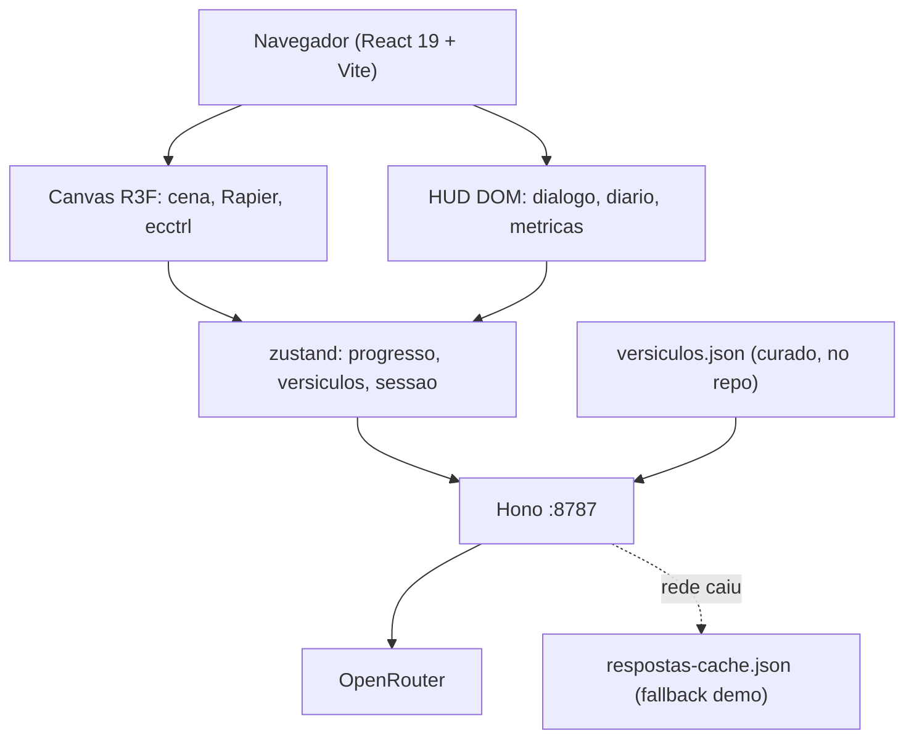

# Selah — pare em meio ao barulho, entre na jornada, reflita sobre a Palavra

Jogo 3D de mundo aberto no navegador. *Selah* é a marcação de pausa que aparece 71 vezes nos Salmos e em Habacuque — e aqui ela não é só o nome, é a mecânica central do jogo.

## Diagnóstico da rede

Testei a conectividade da máquina agora: `registry.npmjs.org`, `github.com` e `openrouter.ai/api/v1` responderam **200 em menos de 400ms**. O bloqueio que vocês encontraram é do **cliente Roblox** (usa portas UDP 49152-65535 próprias), não da web.

Isso vira vantagem no pitch: o jogo roda no navegador, o jurado abre por um link, zero instalação, zero conta Roblox, funciona em Chromebook da escola.

## Conceito

O jogador é uma criança que encontra um mapa antigo e viaja por regiões bíblicas. Cada região é um livro:

- **Vale Central (hub)** — portais para as regiões, quadro de progresso
- **Êxodo** — deserto, Mar Vermelho, Monte Sinai. NPC: Moisés
- **Daniel** — Babilônia, cova dos leões, fornalha. NPC: Daniel
- **Jonas** — só se sobrar tempo (não conte com ela)

Em cada região: 1 NPC conversacional, 5 versículos colecionáveis espalhados pelo mundo, 1 desafio final.

## O Momento Selah — a mecânica que dá nome ao jogo

O nome não pode ser só um rótulo bonito na tela inicial. Quando a criança alcança um versículo colecionável, o jogo executa um **Momento Selah**:

1. O movimento trava e a música ambiente desce para quase silêncio
2. A câmera fecha suavemente no ponto de luz do versículo
3. O texto bíblico aparece sozinho, sem HUD, sem contador, sem barulho
4. O NPC daquela região faz **uma** pergunta gerada pela IA sobre aquele versículo
5. A criança responde com as próprias palavras; a IA avalia e devolve o feedback
6. O mundo volta a respirar e a jornada continua

Isso resolve três problemas de uma vez. Amarra o nome à experiência, então o pitch se explica sozinho. Cria o momento de leitura real que o desafio pede, em vez de deixar o versículo virar item de inventário. E transforma o contraste entre barulho e silêncio em algo que o jurado **sente** na demo, não algo que vocês precisam afirmar no slide.

Tecnicamente é barato: pausar o `<Ecctrl>`, um `useSpring` na câmera, `howler` com fade no volume, e a UI de diálogo que vocês já vão ter construído.

**Contador de Selahs** é a métrica principal do dashboard — quantas pausas reflexivas a criança fez, não quantos minutos jogou. Tempo de tela é métrica de vício; Selah é métrica de encontro. Essa frase vale o pitch inteiro.

## A IA precisa ser real, não cosmética

O briefing exige "uso real de I.A" e "respeito ao texto bíblico". Três usos que atendem os dois:

**1. NPC ancorado no texto (grounding).** O NPC não inventa. O prompt recebe um bloco de versículos reais da passagem, e o system prompt proíbe afirmar qualquer coisa fora deles, exigindo citar a referência. Sem vector DB — em 7h, curadoria manual de 40-60 versículos por região num JSON já é grounding legítimo e defensável.

**2. Quiz aberto avaliado por LLM.** Em vez de múltipla escolha, a criança **escreve ou fala** o que entendeu e o LLM avalia com rubrica, devolvendo JSON estruturado. É aqui que a IA faz algo impossível sem ela.

```ts
// resposta do avaliador
{ compreendeu: boolean, nivel: 1|2|3, feedback: string, versiculoSugerido: string }
```

**3. Adaptação de dificuldade.** O nível das perguntas seguintes muda conforme o histórico. Simples de implementar, forte no pitch.

## Stack (versões verificadas hoje)

```bash
npm create vite@latest selah -- --template react-ts
npm i three@0.185.1 @react-three/fiber@9.7.0 @react-three/drei@10.7.8 \
      @react-three/rapier@2.2.0 ecctrl@2.0.1 zustand@5.0.15 howler@2.2.4
npm i -D @types/three tailwindcss@4.3.3 @tailwindcss/vite leva@0.10.1
npm i hono @hono/node-server openai@7.8.0 tsx concurrently
```

- `**ecctrl**` é o item mais importante da lista: character controller de terceira pessoa pronto (pular, correr, câmera orbital, física). Economiza 1-2 horas que vocês não têm.
- `**@react-three/rapier**` para colisão de terreno e gatilhos de área.
- `**leva**` cria um painel de sliders para ajustar velocidade, altura de pulo, névoa e posição de luz **com o jogo rodando**, sem recompilar. Numa maratona de tuning cego isso paga os 10 minutos de instalação. Escondam com `<Leva hidden />` antes da demo.
- **Hono** num processo separado (porta 8787) só para proxiar o OpenRouter. **A chave nunca vai para o cliente** — `VITE_` expõe no bundle.
- `**openai**` (o SDK oficial) fala com o OpenRouter só trocando a `baseURL`. Evita escrever `fetch` com parsing manual de SSE, que é onde muito time perde uma hora:

```ts
const client = new OpenAI({
  baseURL: "https://openrouter.ai/api/v1",
  apiKey: process.env.OPENROUTER_API_KEY,
});
```

### Assets 3D — não modele nada

- [Kenney.nl](https://kenney.nl/assets) — Nature Kit, Castle Kit, Survival Kit, Blocky Characters. Todos **CC0**, `.glb` pronto
- [Quaternius](https://quaternius.com) — personagens modulares animados, CC0
- [Poly Pizza](https://poly.pizza) — busca por modelo avulso

Baixem tudo **na primeira meia hora** e commitem no repo. Se a rede oscilar às 14h, vocês estão salvos.

### Texto bíblico

Repo `[thiagobodruk/biblia](https://github.com/thiagobodruk/biblia)` tem a Bíblia inteira em JSON. Usem a **Almeida Revista e Corrigida (ACF/AA)**, que é domínio público. Baixem o JSON, não dependam de API externa.

## Arquitetura




### Endpoints do proxy

- `POST /api/npc` — conversa com NPC. Recebe `{ regiao, mensagem, historico }`, injeta os versículos da região, responde em **streaming** (o texto aparecendo letra a letra faz o NPC parecer vivo)
- `POST /api/avaliar` — recebe a resposta da criança, devolve o JSON da rubrica

### Modelos no OpenRouter

Verifiquei os gratuitos disponíveis agora: `google/gemma-4-31b-it:free`, `minimax/minimax-m3:free`, `z-ai/glm-5.2:free`.

Configure via env com fallback em cascata — se o `:free` estourar rate limit no meio da demo, cai para um pago barato automaticamente. Rate limit de modelo gratuito em dia de hackathon é risco real.

## Cronograma — 7 horas, 4 pessoas

Papéis: **A** = engine/3D, **B** = IA/backend, **C** = conteúdo/level design, **D** = pitch/UI.

### 0:00–0:30 — Setup paralelo

Ninguém espera ninguém. A faz o scaffold e commita em 10 minutos; os outros clonam.

- **A**: scaffold Vite + deps + repo no GitHub
- **B**: conta OpenRouter, chave, testa `curl` no endpoint
- **C**: baixa os kits Kenney e o JSON da Bíblia, commita em `public/models/` e `src/data/`
- **D**: escreve o roteiro do pitch (sim, agora — não no final)

### 0:30–1:30 — Vertical slice

Meta: personagem andando num chão com física + NPC devolvendo uma frase da IA. Feio, mas ponta a ponta.

- **A**: `<Canvas>`, luz, plano com `RigidBody`, `<Ecctrl>` com um cubo. Se o cubo anda, o resto é decoração
- **B**: Hono com `/api/npc` em streaming, system prompt do Moisés
- **C**: curadoria de `src/data/exodo.json` — 40 versículos + 5 marcados como colecionáveis
- **D**: layout do HUD e da caixa de diálogo em Tailwind

**Checkpoint 1:30:** se o personagem não anda ainda, cortem a física e usem movimento cinemático simples.

### 1:30–3:00 — Região Êxodo completa

- **A + C**: montam o mapa com os kits (dunas, palmeiras, tendas, o mar partido)
- **A**: gatilho de proximidade abre o diálogo do NPC; colecionáveis com `useFrame` girando
- **B**: grounding funcionando — o Moisés cita referência de versículo corretamente
- **D**: tela inicial + diário de versículos coletados

### 3:00–4:00 — Momento Selah + métricas

Esta é a hora mais importante do dia. Se algo tiver que ser cortado, corte a região 2, nunca isto.

- **A**: implementa o Momento Selah — pausa do `<Ecctrl>`, `useSpring` na câmera, fade do áudio, HUD sumindo
- **B**: `/api/avaliar` com rubrica em JSON estruturado
- **A**: UI de resposta aberta (input de texto; Web Speech API para voz se sobrar tempo)
- **D**: dashboard de engajamento — **contador de Selahs**, versículos coletados, perguntas feitas, nível de compreensão. **Isto é o que responde "métrica clara de engajamento" do briefing**

### 4:00–5:00 — Região Daniel + hub

Reuso puro dos sistemas. Se a região 1 ficou bem feita, esta sai em 45 minutos.

- **C**: `daniel.json` + mapa da Babilônia
- **A**: hub central com dois portais

### 5:00–5:45 — Polimento

Áudio ambiente (`howler`), névoa, céu (`<Sky>` do drei), `<Environment>` para iluminação decente. Bloom **só se rodar a 60fps** no notebook do jurado.

### 5:45–6:15 — CONGELAMENTO DE CÓDIGO

Regra sem exceção. Ninguém commita feature depois disto.

- Deploy no Vercel/Netlify (front) + Render/Fly (proxy)
- **Gravar vídeo de 2 minutos da demo funcionando**
- **Rodar a demo inteira uma vez com o Wi-Fi desligado** para validar o cache de fallback

### 6:15–7:00 — Ensaio

Três vezes, cronometrado. Quem fala o quê, em que ordem.

## Riscos e mitigações

- **A rede cai na apresentação** → `respostas-cache.json` com as respostas dos NPCs pré-geradas. O jogo degrada mas não quebra. Vídeo gravado como último recurso
- **Rate limit do modelo gratuito** → cascata de modelos configurada desde o início
- **Escopo estoura** → 2 regiões é o alvo, 1 região polida é melhor que 3 quebradas. Corte a região 2 às 4:30 se não estiver fluindo
- **Performance no notebook do jurado** → sem sombras dinâmicas, `<Instances>` para vegetação repetida, testem em máquina fraca antes do freeze
- **Alucinação bíblica ao vivo** → o system prompt exige recusa educada quando a pergunta sai do contexto fornecido. Testem perguntas maliciosas antes da demo; um jurado vai tentar

## O que dizer no pitch

1. Abram explicando o nome. *Selah* aparece 71 vezes na Bíblia como uma instrução para parar. Uma criança hoje recebe o dia inteiro de estímulo sem uma única pausa — e é justamente a pausa que o texto bíblico pede. O nome entrega o problema e a solução na mesma frase
2. Demonstrem **ao vivo** um Momento Selah. Deixem o silêncio acontecer na sala; não falem por cima dele. É o único momento da demo em que o jurado sente algo em vez de avaliar algo
3. Mostrem o NPC citando versículo real e a criança respondendo com as próprias palavras
4. Mostrem o dashboard: **"nós não medimos tempo de tela, medimos Selahs"**. É o diferencial contra os projetos que só põem um chatbot na tela
5. Fechem no "roda em qualquer navegador, inclusive Chromebook de escola pública"

