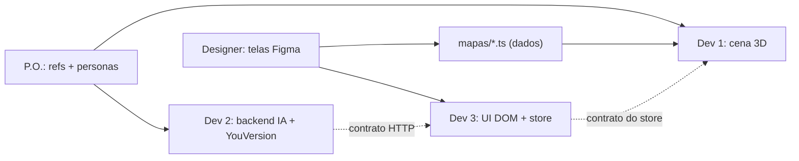
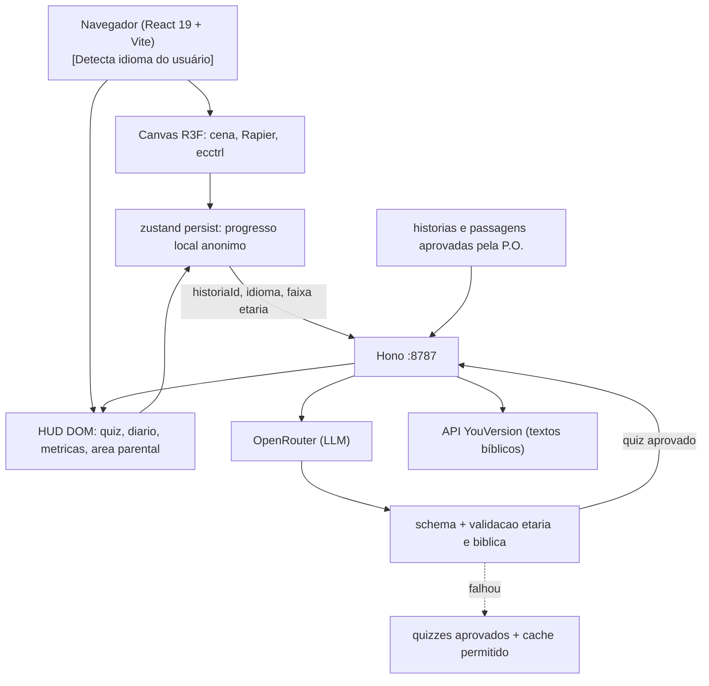

# Selah — pare em meio ao barulho, entre na jornada, reflita sobre a Palavra

Jogo 3D de mundo aberto no navegador. *Selah* é a marcação de pausa que aparece 71 vezes nos Salmos e em Habacuque, e aqui não é só o nome: é a mecânica central.

## Diagnóstico da rede

Testei a conectividade agora: `registry.npmjs.org`, `github.com` e `openrouter.ai/api/v1` responderam **200 em menos de 400ms**. O bloqueio que vocês encontraram é do **cliente Roblox** (usa portas UDP 49152–65535 próprias), não da web.

Isso vira vantagem no pitch: o jogo roda no navegador, o jurado abre por um link, zero instalação, zero conta Roblox, funciona em Chromebook de escola.

## Conceito

O jogador é uma criança que encontra um mapa antigo e viaja por regiões bíblicas:

- **Vale Central (hub)** — portais para as regiões, quadro de progresso
- **A Criação** — um mundo vazio ganha luz, natureza, animais e vida
- **Noé e a Arca** — preparação da arca, materiais, animais e a chegada da chuva
- **José, o Sonhador** — sonhos, adversidades, perdão e propósito até o Egito

Para a hackathon, **A Criação** é a única região obrigatória e deve receber todo o polimento. **Noé** só entra depois que a jornada principal e o Momento Selah estiverem estáveis. **José** compõe a visão do produto e fica como expansão pós-demo, salvo decisão explícita da P.O. de substituir escopo já concluído.

Em cada região: 1 NPC virtual narrativo, 5 versículos colecionáveis e 1 desafio final. Os NPCs deixam claro que são personagens automatizados e apresentam quizzes gerados por IA; não há chat ou entrada de texto livre.

## O Momento Selah — a mecânica que dá nome ao jogo

Quando a criança alcança um versículo colecionável:

1. O movimento trava e a música ambiente desce para quase silêncio
2. A câmera fecha suavemente no ponto de luz do versículo
3. O texto bíblico aparece sozinho, sem HUD, sem contador
4. O NPC da região apresenta **uma** pergunta A/B/C/D gerada pela IA sobre aquele versículo
5. A criança escolhe uma alternativa e recebe uma explicação validada, adequada à faixa etária
6. O jogo entra numa **Pausa Selah real**: exploração, controles e novos desafios ficam indisponíveis
7. A criança é convidada a sair da tela, conversar ou refletir; somente o responsável libera localmente a próxima sessão
8. Após a liberação, o mundo volta a respirar

Isso amarra o nome à experiência, cria leitura real em vez de item de inventário, e faz o jurado **sentir** o contraste entre barulho e silêncio em vez de ler sobre ele num slide.

Tecnicamente é barato: pausar o `<Ecctrl>`, um `useSpring` na câmera, `howler` com fade no volume, e a UI de diálogo já construída.

### Fala do texto (TTS) — acessibilidade para quem ainda não lê

**Ideia no escopo (Dev 2).** Uma determinada faixa etária — principalmente crianças que ainda não sabem ler — precisa **ouvir** o texto, não só vê-lo. Sem isso, o Momento Selah exclui parte do público-alvo.

- **O quê:** ler em voz alta o versículo do Momento Selah e, se der tempo, a pergunta/feedback do NPC
- **Como:** `speechSynthesis` da Web Speech API no navegador (grátis, sem backend, sem chave). O `lang` segue o `idioma` do store (`pt-BR`, `en-US`, `es-ES`)
- **Quando:** se `faixaEtaria === "crianca"` ou `ttsAtivo === true`, o versículo toca ao abrir o Selah; botão “ouvir / pausar” sempre disponível na UI
- **Quem:** Dev 2 entrega `src/services/tts.ts` (falar / pausar / cancelar); Dev 3 liga no store e no botão da UI do Selah
- **Prioridade:** depois da geração e validação do quiz. Se o tempo apertar, vira stretch — mas a ideia fica no pitch como acessibilidade explícita
- **Não confundir** com input por voz: não há resposta aberta; TTS aqui é somente *output* (máquina lê o texto)

### Métrica clara de engajamento

A métrica oficial do hackathon é a **Taxa de Conclusão do Momento Selah**: `Selahs concluídos / Selahs iniciados × 100`. Um Selah é iniciado ao abrir a reflexão e concluído após responder ao quiz e entrar na Pausa Selah. O dashboard local mostra iniciados, concluídos, taxa de conclusão e acertos de quiz; o painel do projeto recebe apenas os mesmos totais agregados por dia, história e versão.

O contador de Selahs prioriza encontro em vez de tempo de tela. A pausa não fica apenas dentro da narrativa: ela interrompe o ciclo de jogo e leva a proposta para a vida real, ajudando a reduzir o tempo contínuo de tela.

O bloqueio vale somente para a exploração dentro do Selah — nunca bloqueia o navegador, o aparelho ou a possibilidade de fechar o jogo. A tela de pausa não usa contagem regressiva, culpa, urgência ou recompensa por permanecer conectado. A liberação do responsável acontece no próprio dispositivo e não envia PIN, horário ou qualquer outro dado ao backend.

## Time e divisão de responsabilidades

O princípio que organiza tudo: **só o Dev 1 escreve código 3D**. Os outros dois trabalham em áreas que não exigem Three.js e não ficam bloqueados esperando a cena ficar pronta.

- **Dev 1 — Engine (o que manja de jogos).** Canvas R3F, física Rapier, character controller, Momento Selah, portais, performance. É o gargalo crítico do projeto: **protejam o tempo dele**. Ele não faz deploy, não escreve prompt, não monta slide, não responde pergunta de ambiente dos outros
- **Dev 2 — IA e backend.** Servidor Hono, integração OpenRouter com ZDR, proxy YouVersion, geração e validação dos quizzes, correção, cache de fallback e serviço TTS no cliente. É TypeScript testável sem depender do 3D
- **Dev 3 — Interface e estado.** Toda a UI é React DOM posicionada por cima do canvas: quiz, diário, seletores de idioma/faixa etária, botão ouvir, dashboard, transparência da IA, tela para responsáveis e transições. Mais o store zustand e sua persistência local. Zero 3D
- **Designer.** Identidade do Selah, telas no Figma, curadoria dos assets Kenney e level design por dados (explicado abaixo)
- **P.O.** Seleção e aprovação das histórias, referências e faixa etária, personas dos NPCs, fallback dos quizzes, roteiro e slides do pitch, e **guardião do cronômetro** — é quem decide os cortes de escopo

### Como o designer faz level design sem programar

O Dev 1 expõe o mapa como um array de dados puro, e o designer edita esse arquivo direto com o Vite em hot reload, vendo o resultado na tela em tempo real:

```ts
// src/mapas/criacao.ts
export const props = [
  { modelo: "arvore", pos: [12, 0, -8], rot: 0.4, escala: 1.2 },
  { modelo: "rocha",  pos: [-5, 0, 3],  rot: 0,   escala: 1 },
];
```

Ele nunca abre um arquivo de componente. É praticamente uma planilha, e libera o Dev 1 de gastar duas horas posicionando árvore.

### Contrato do store — definir nos primeiros 20 minutos

Isto é o que permite os três trabalharem em paralelo sem colidir. Dev 3 escreve, todos concordam, ninguém muda depois sem avisar:

```ts
type Estado = {
  regiao: "hub" | "criacao" | "noe" | "jose";
  idioma: string;                     // "pt-BR" | "en-US" | "es-ES" | ...
  faixaEtaria: "crianca" | "geral";   // ativa TTS automático no Selah quando "crianca"
  ttsAtivo: boolean;                  // toggle manual de fala do texto
  versiculosColetados: string[];      // ["Ex 14:14", ...]
  selahsIniciados: number;
  selahsCompletados: number;
  selahAtivo: null | { ref: string; texto: string };
  quizAtivo: null | Quiz;
  historico: ResultadoQuiz[];
  salvarProgresso: boolean;
  compartilharMetricas: boolean;     // consentimento local do responsável
  pausaParentalAtiva: boolean;
  dialogoAberto: boolean;
  setIdioma: (idioma: string) => void;
  setFaixaEtaria: (faixa: "crianca" | "geral") => void;
  setTtsAtivo: (ativo: boolean) => void;
  abrirSelah: (ref: string) => void; // incrementa selahsIniciados
  fecharSelah: () => void;
};
```

O store usa `zustand/persist` sobre `localStorage`, sem conta ou identificador remoto. Salva somente IDs de passagens, Selahs e resultados A/B/C/D. Não salva prompts, respostas completas da LLM, texto bíblico integral sem permissão da licença, localização, escola, igreja ou qualquer inferência religiosa. O usuário pode jogar sem salvar e apagar todo o progresso; o histórico individual nunca é sincronizado com o backend nem enviado ao OpenRouter.

Quando o responsável consentir, o cliente envia ao Hono apenas eventos mínimos de produto — `selah_iniciado`, `selah_concluido` e `quiz_respondido` com `historiaId`, versão do app e se acertou — para compor contadores agregados. Não envia histórico, identificador persistente, cookie analítico ou fingerprint. O IP é registrado somente em log de segurança segregado, para rate limiting e diagnóstico, com acesso restrito e expiração automática em até 7 dias; ele não entra nas tabelas analíticas nem permite montar uma jornada individual.

Dev 1 só chama `abrirSelah()`. Dev 3 só lê `selahAtivo` para renderizar. Nenhum dos dois precisa do código do outro para trabalhar.

**Dev 3 desenvolve numa rota `/lab` sem canvas nenhum**, com dados mockados. Se a cena 3D estiver quebrada às 14h, a UI dele continua avançando.



## Stack (versões verificadas hoje)

```bash
npm create vite@latest selah -- --template react-ts
npm i three@0.185.1 @react-three/fiber@9.7.0 @react-three/drei@10.7.8 \
      @react-three/rapier@2.2.0 ecctrl@2.0.1 zustand@5.0.15 howler@2.2.4
npm i -D @types/three tailwindcss@4.3.3 @tailwindcss/vite leva@0.10.1
npm i hono @hono/node-server openai@7.8.0 tsx concurrently
```

- **ecctrl** é o item mais importante: character controller de terceira pessoa pronto. Economiza 1-2 horas que vocês não têm
- **@react-three/rapier** para colisão de terreno e gatilhos de área
- **leva** dá sliders para ajustar velocidade, pulo e luz **com o jogo rodando**. Escondam com `<Leva hidden />` antes da demo
- **Hono** em processo separado (porta 8787) para proxiar o OpenRouter e a YouVersion. **A chave nunca vai ao cliente** — `VITE_` expõe no bundle
- **openai** fala com OpenRouter trocando só a `baseURL`, evitando parsing manual de SSE:

```ts
const client = new OpenAI({
  baseURL: "https://openrouter.ai/api/v1",
  apiKey: process.env.OPENROUTER_API_KEY,
});
```

### Assets — não modelem nada

- [Kenney.nl](https://kenney.nl/assets) — Nature Kit, Castle Kit, Survival Kit, Blocky Characters. Todos **CC0**, `.glb` pronto
- [Quaternius](https://quaternius.com) — personagens modulares animados, CC0
- [Poly Pizza](https://poly.pizza) — busca por modelo avulso

Baixem tudo **na primeira meia hora** e commitem no repo em `public/models/`. Se a rede oscilar às 14h, vocês estão salvos.

### Texto bíblico — API da YouVersion (multilíngue)

O jogo consome a **API da YouVersion** via proxy Hono (`src/services/`):

- **Detecção / seleção de idioma:** detecta o idioma do navegador (`pt-BR`, `en-US`, `es-ES`) com opção de troca manual no menu
- **Versão bíblica dinâmica:** YouVersion devolve o texto na versão correspondente ao idioma (ex.: NVI/ARA em português, NIV/ESV em inglês, RVR em espanhol)
- **Cache local e fallback:** versículos de cada região ficam cacheados na sessão; se a rede oscilar, o jogo usa o cache. Para a demo offline, pré-gerar também um snapshot dos textos das regiões ativas
- **Licença e atribuição:** usar apenas versões liberadas para o projeto, exibir o copyright exigido e validar se cada licença permite cache ou snapshot offline

A P.O. mantém uma allowlist de histórias e referências com faixa etária, tema e status de aprovação. A LLM nunca escolhe passagens; recebe somente o texto aprovado da história ativa. Não usar login, highlights ou perfil da criança na YouVersion — apenas a autenticação da aplicação no backend.

## Arquitetura



### Estrutura de pastas e divisão de responsabilidades

Para reduzir conflitos entre as frentes da hackathon, a estrutura abaixo é a convenção oficial. Cada pessoa deve limitar suas alterações à sua área, salvo alinhamento explícito quando um contrato compartilhado precisar mudar.

```text
src/
├── game/                 # Dev 1 — Canvas, jogador, física, regiões e interações 3D
├── maps/                 # Dev 1 + Designer — layout declarativo de criação, Noé e José
├── components/
│   └── ui/               # Dev 3 — HUD, diálogo, quiz, diário e telas parentais
├── stores/               # Dev 3 — contratos e estado global Zustand
├── services/             # Dev 2 — clientes do proxy, YouVersion e TTS
├── content/              # P.O. + Dev 2 — histórias aprovadas, passagens e quizzes fallback
└── types/                # Contratos compartilhados entre jogo, UI e serviços
server/
├── routes/               # Dev 2 — endpoints de quiz, versículo e métricas
├── services/             # Dev 2 — integrações OpenRouter e YouVersion
└── validators/           # Dev 2 — schemas e validações etárias, bíblicas e de privacidade
public/
└── models/               # Designer + Dev 1 — assets 3D CC0 baixados para uso offline
```

Responsáveis principais: **Dev 1** atua em `src/game/` e `src/maps/`; **Dev 2** em `server/`, `src/services/` e, junto à P.O., `src/content/`; **Dev 3** em `src/components/ui/` e `src/stores/`; o **Designer** mantém os assets em `public/models/` e colabora nos layouts declarativos de `src/maps/`. Mudanças em `src/types/` e no contrato do store devem ser comunicadas ao time antes de serem integradas.

### Estratégia mobile e publicação em lojas — escopo opcional

O projeto continua **web-first** com React, Vite e React Three Fiber; não migrar para React Native. A mesma aplicação deve aceitar teclado/mouse e touch por uma camada de controles desacoplada da movimentação do personagem.

Se o núcleo da demo estiver pronto antes do congelamento, implementar nesta ordem:

1. HUD responsivo, orientação horizontal e suporte às `safe-area-inset-*`
2. Joystick virtual, câmera por arrasto e botões touch de interação/pulo
3. Perfil gráfico mobile, reduzindo sombras, pós-processamento, resolução e distância de renderização
4. PWA instalável, somente se os itens anteriores estiverem estáveis

Publicação futura na Play Store e App Store será feita com **Capacitor**, empacotando o build web em projetos Android e iOS. Capacitor não é dependência necessária para a demo e só deve ser adicionado quando houver trabalho real de publicação. O aplicativo de loja deverá ter experiência própria de app — controles touch, tela cheia, assets essenciais locais, progresso persistente, ícone/splash e comportamento útil offline — e não apenas abrir o site dentro de um contêiner.

```text
React + Vite + R3F
├── navegador / PWA
├── Capacitor Android → Google Play
└── Capacitor iOS → App Store
```

## A IA precisa ser real, não cosmética

**1. Quiz ancorado no texto.** O prompt recebe uma passagem escolhida pela P.O. e obtida via YouVersion no idioma ativo. A LLM não escolhe a história e não pode usar conhecimento externo, inventar fatos ou complementar a narrativa.

**2. Geração estruturada e validada.** A LLM gera uma pergunta adequada à faixa etária, quatro alternativas, exatamente uma resposta correta, explicação e referência. O backend valida o schema e o suporte textual antes de mostrar o conteúdo:

```ts
type Quiz = {
  id: string;
  passagemId: string;
  pergunta: string;
  alternativas: { id: "A" | "B" | "C" | "D"; texto: string }[];
  respostaCorretaId: "A" | "B" | "C" | "D";
  explicacao: string;
  referencia: string;
};
```

Se a saída for inválida, inadequada ou não sustentada pela passagem, ela é descartada e o jogo usa um quiz previamente aprovado. A correção é determinística; a resposta da criança nunca volta à LLM.

**3. Adaptação sem perfil remoto.** A dificuldade pode considerar resultados agregados guardados exclusivamente no navegador, enviando ao backend apenas `facil`, `medio` ou `dificil`, nunca o histórico completo.

### Privacidade e segurança infantil

- Antes do jogo, responsáveis recebem explicação simples sobre IA, dados locais e faixa etária; podem desativar IA e usar somente quizzes em cache
- Responsáveis configuram localmente a liberação da Pausa Selah e podem encerrar a pausa por uma área protegida; nenhum PIN ou configuração parental sai do dispositivo
- Na primeira interação, o NPC informa à criança que é um personagem virtual automatizado que usa IA para criar desafios
- Sem cadastro infantil, publicidade, analytics comportamental, fingerprinting ou identificadores persistentes para rastreamento
- A telemetria de produto é opcional e explicada ao responsável antes do primeiro envio: registra somente eventos mínimos agregáveis para medir conclusão de Selahs e acerto de quiz, sem criar perfil persistente
- O endereço IP é dado pessoal e fica restrito a log operacional separado para rate limiting e diagnóstico; acesso restrito, sem uso analítico e retenção máxima de 7 dias
- OpenRouter com Zero Data Retention obrigatório por requisição, `data_collection: "deny"` e prompt logging desativado
- O proxy não registra conteúdo de quiz, prompts ou respostas da criança; armazena apenas contadores agregados de produto e métricas técnicas sem conteúdo
- Progresso e histórico individual ficam somente no navegador, com opções **Jogar sem salvar** e **Apagar progresso**
- Sem loot boxes, streaks, urgência artificial ou recompensas por permanecer conectado; durante a Pausa Selah, ficar com a tela aberta não acelera nem concede vantagem
- Antes de lançamento público, realizar revisão jurídica e avaliação formal de impacto à privacidade, segurança e saúde infantil

### Endpoints

- `POST /api/quiz/gerar` — `{ historiaId, passagemId, idioma, faixaEtaria, dificuldade }` → quiz validado ou fallback; não recebe histórico da criança
- `POST /api/quiz/responder` — `{ quizId, alternativaId }` → `{ acertou, explicacao, referencia }`; não persiste a resposta
- `GET /api/versiculo` — `{ passagemId, idioma }` → texto autorizado via YouVersion, atribuição e cache permitido pela licença
- `POST /api/metricas/eventos` — recebe lote validado de eventos mínimos (`selah_iniciado`, `selah_concluido`, `quiz_respondido`) somente após consentimento; aplica rate limit por IP, grava IP em log operacional segregado e incrementa somente contadores agregados por dia, história e versão

### Modelos

Escolher modelos no OpenRouter somente entre endpoints com ZDR disponível no dia da implementação. Configurar cascata restrita a esses provedores; se nenhum estiver disponível ou a validação falhar, usar quiz local aprovado.

## Cronograma — 7 horas

### 0:00–0:30 — Setup paralelo

Ninguém espera ninguém. Dev 1 commita o scaffold em 10 minutos e os outros clonam.

- **Dev 1**: scaffold Vite + deps + repo no GitHub
- **Dev 2**: conta e chave OpenRouter + YouVersion; ativa ZDR, desativa prompt logging, valida ambos com `curl`; esqueleto de `src/services/`
- **Dev 3**: escreve o contrato do store persistente local (incluindo `idioma`, `faixaEtaria`, `ttsAtivo`, quiz e histórico anônimo) e publica no grupo
- **Designer**: baixa e organiza os kits Kenney/Quaternius em `public/models/`
- **P.O.**: abre o documento de curadoria com faixa etária, recorte e referências aprovadas de A Criação

### 0:30–1:30 — Vertical slice

Meta: personagem andando + NPC apresentando um quiz JSON gerado pela IA. Feio, mas ponta a ponta.

- **Dev 1**: `<Canvas>`, plano com `RigidBody`, `<Ecctrl>` com um cubo. Se o cubo anda, o resto é decoração
- **Dev 2**: `/api/quiz/gerar` com schema + primeira chamada YouVersion funcionando
- **Dev 3**: quiz A/B/C/D, HUD e seletor de idioma na rota `/lab`, com mock
- **Designer**: identidade no Figma — cor, tipografia, tela inicial
- **P.O.**: recorte de A Criação aprovado por faixa etária, com referências candidatas e 5 colecionáveis definidos

**Checkpoint 1:30 (P.O. cobra):** se o personagem não anda, cortem a física e usem movimento cinemático.

### 1:30–3:00 — Região A Criação

- **Dev 1**: carrega os `.glb`, gatilho de proximidade, colecionáveis girando
- **Dev 2**: geração validada — quatro alternativas, uma correta, explicação sustentada pelo texto e fallback aprovado
- **Dev 3**: diário, histórico local, Jogar sem salvar e Apagar progresso + tela inicial com o visual do designer
- **Designer**: preenche `mapas/criacao.ts` com a progressão de vazio/escuridão para luz, natureza e vida
- **P.O.**: define a voz do narrador virtual, revisa quizzes de fallback e começa o recorte aprovado de Noé

### 3:00–4:00 — Momento Selah

**A hora mais importante do dia.** Se algo tiver que cair, é a região de Noé, nunca isto.

- **Dev 1**: pausa do `<Ecctrl>`, `useSpring` na câmera, fade do áudio e bloqueio da exploração enquanto `pausaParentalAtiva`
- **Dev 2**: `/api/quiz/responder`, validação etária/bíblica e teste de falha fechada; se sobrar tempo, `src/services/tts.ts` para leitura do versículo e quiz
- **Dev 3**: UI do Selah (versículo, alternativas, explicação e botão ouvir), Pausa Selah com liberação local do responsável, transparência da IA e dashboard local
- **Designer**: arte do momento de pausa — luz, partícula, tipografia grande
- **P.O.**: testa como criança testaria, inclusive sem ler e só ouvindo, tenta provocar geração inadequada e reporta o que confunde

### 4:00–5:00 — Hub + região de Noé, se a jornada principal estiver estável

Reuso puro. Se a região 1 ficou bem feita, esta sai em 45 minutos.

- **Dev 1**: hub com portais para A Criação, Noé e José; somente o portal de A Criação precisa estar jogável, e Noé entra se houver tempo
- **Designer**: `mapas/noe.ts`; José permanece como expansão pós-demo
- **Dev 2**: quizzes aprovados de fallback + snapshot YouVersion das regiões quando permitido pelas licenças
- **Dev 3 + P.O.**: montam os slides

### 5:00–5:45 — Polimento

Áudio com `howler`, `<Sky>` e `<Environment>` do drei. Bloom só se rodar a 60fps. Se o TTS ainda não entrou: Dev 2 + Dev 3 fecham o botão “ouvir” no Selah com `speechSynthesis` — demo de 30 segundos no pitch.

Se toda a jornada principal já estiver funcionando e validada, usar apenas o tempo restante para suporte mobile: HUD responsivo, controles touch e perfil gráfico reduzido. Não instalar Capacitor durante a hackathon; a prioridade continua sendo uma demo web completa e estável.

### 5:45–6:15 — CONGELAMENTO DE CÓDIGO

Regra sem exceção. O P.O. faz cumprir.

- Deploy: Vercel/Netlify (front) + Render/Fly (proxy)
- **Gravar vídeo de 2 minutos da demo funcionando**
- **Rodar a demo com o Wi-Fi desligado** para validar o fallback

### 6:15–7:00 — Ensaio

Três vezes, cronometrado. P.O. apresenta, Dev 1 opera o jogo, os outros ficam calados.

## Riscos e mitigações

- **Dev 1 vira gargalo e os outros travam** → contrato do store nos primeiros 20 minutos, Dev 3 na rota `/lab`, Dev 2 no `curl`. Ninguém precisa do jogo rodando para trabalhar
- **A rede cai na apresentação** → `respostas-cache.json` + snapshot YouVersion pré-gerado. Vídeo como último recurso
- **YouVersion indisponível / rate limit** → cache de sessão + snapshot local das refs das regiões ativas; o NPC nunca depende de fetch ao vivo na demo
- **Rate limit do modelo grátis** → cascata configurada desde o início
- **Modelo/provedor retém conteúdo** → exigir ZDR e `data_collection: "deny"`; se não houver endpoint compatível, usar fallback local
- **Escopo estoura** → A Criação polida vence três regiões quebradas. Corte Noé às 4:30 se não estiver fluindo; José permanece pós-demo
- **Performance no notebook do jurado** → sem sombras dinâmicas, `<Instances>` para vegetação, testar em máquina fraca antes do freeze
- **Mobile compromete o caminho crítico** → manter como tarefa opcional depois da jornada principal; preparar UI e controles desacoplados desde o início, mas adiar PWA e Capacitor
- **WebGL excede memória no celular** → modelos `.glb` e texturas comprimidos, perfil gráfico mobile e testes em Safari iOS e Chrome Android reais
- **App rejeitado como site reempacotado** → na publicação futura, entregar controles touch, persistência, offline, tela cheia e acabamento nativo antes de submeter às lojas
- **Quiz inadequado ou biblicamente incorreto** → allowlist da P.O., schema estrito, validação antes da exibição e fallback aprovado; testar saídas adversariais antes da demo
- **Histórico local expõe preferências em dispositivo compartilhado** → sem nomes ou texto livre, opção Jogar sem salvar, botão Apagar progresso e nenhuma sincronização remota
- **Pausa parental vira frustração ou dark pattern** → explicar a regra antes do jogo, bloquear somente a exploração, permitir fechar livremente e não premiar tempo com a tela aberta
- **Licença não permite cache de uma tradução** → guardar somente IDs e atribuição; gerar snapshot apenas das versões expressamente autorizadas

## O que dizer no pitch

1. Abram explicando o nome. *Selah* aparece 71 vezes na Bíblia como instrução para parar. Uma criança hoje recebe estímulo o dia inteiro sem uma única pausa, e é justamente a pausa que o texto pede. O nome entrega problema e solução na mesma frase
2. Demonstrem **ao vivo** um Momento Selah. Deixem o silêncio acontecer na sala e não falem por cima dele
3. Mostrem que o jogo permanece em pausa até a liberação do responsável: a mecânica sai da tela e cria um intervalo real
4. Mostrem o NPC virtual explicando que usa IA e apresentando um quiz novo, validado e baseado no versículo real da YouVersion no idioma da criança
5. Se o TTS estiver pronto: mostrem a criança **ouvindo** o versículo e o quiz — acessibilidade para quem ainda não lê
6. Mostrem o dashboard: **"não medimos tempo de tela, medimos Selahs"**
7. Fechem no "roda em qualquer navegador, inclusive Chromebook de escola pública"
