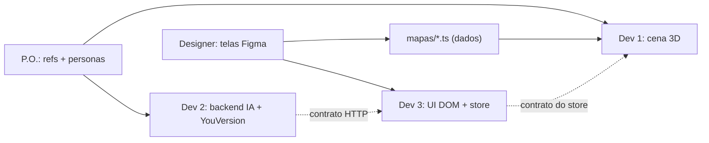
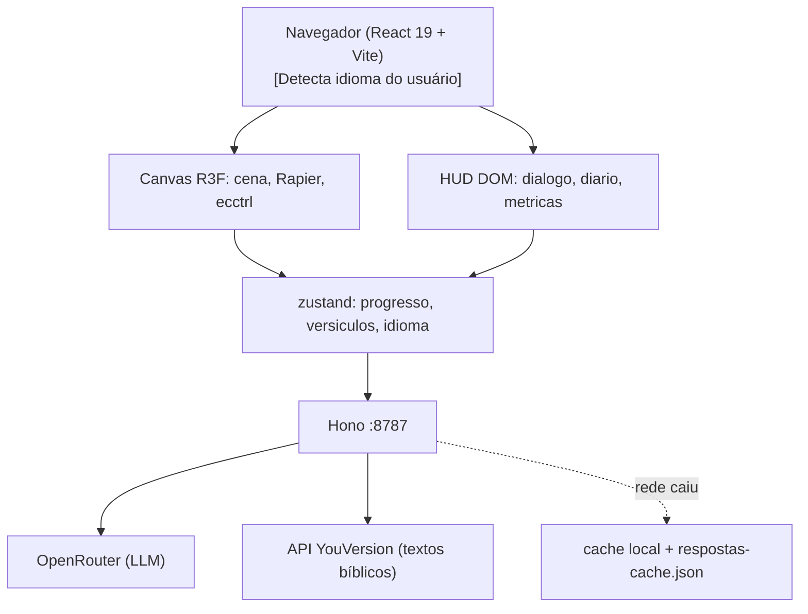

# Selah — pare em meio ao barulho, entre na jornada, reflita sobre a Palavra

Jogo 3D de mundo aberto no navegador. *Selah* é a marcação de pausa que aparece 71 vezes nos Salmos e em Habacuque, e aqui não é só o nome: é a mecânica central.

## Diagnóstico da rede

Testei a conectividade agora: `registry.npmjs.org`, `github.com` e `openrouter.ai/api/v1` responderam **200 em menos de 400ms**. O bloqueio que vocês encontraram é do **cliente Roblox** (usa portas UDP 49152–65535 próprias), não da web.

Isso vira vantagem no pitch: o jogo roda no navegador, o jurado abre por um link, zero instalação, zero conta Roblox, funciona em Chromebook de escola.

## Conceito

O jogador é uma criança que encontra um mapa antigo e viaja por regiões bíblicas:

- **Vale Central (hub)** — portais para as regiões, quadro de progresso
- **Êxodo** — deserto, Mar Vermelho, Monte Sinai. NPC: Moisés
- **Daniel** — Babilônia, cova dos leões, fornalha. NPC: Daniel
- **Jonas** — só se sobrar tempo (não conte com ela)

Em cada região: 1 NPC conversacional, 5 versículos colecionáveis, 1 desafio final.

## O Momento Selah — a mecânica que dá nome ao jogo

Quando a criança alcança um versículo colecionável:

1. O movimento trava e a música ambiente desce para quase silêncio
2. A câmera fecha suavemente no ponto de luz do versículo
3. O texto bíblico aparece sozinho, sem HUD, sem contador
4. O NPC da região faz **uma** pergunta gerada pela IA sobre aquele versículo
5. A criança responde com as próprias palavras; a IA avalia e devolve feedback
6. O mundo volta a respirar

Isso amarra o nome à experiência, cria leitura real em vez de item de inventário, e faz o jurado **sentir** o contraste entre barulho e silêncio em vez de ler sobre ele num slide.

Tecnicamente é barato: pausar o `<Ecctrl>`, um `useSpring` na câmera, `howler` com fade no volume, e a UI de diálogo já construída.

### Fala do texto (TTS) — acessibilidade para quem ainda não lê

**Ideia no escopo (Dev 2).** Uma determinada faixa etária — principalmente crianças que ainda não sabem ler — precisa **ouvir** o texto, não só vê-lo. Sem isso, o Momento Selah exclui parte do público-alvo.

- **O quê:** ler em voz alta o versículo do Momento Selah e, se der tempo, a pergunta/feedback do NPC
- **Como:** `speechSynthesis` da Web Speech API no navegador (grátis, sem backend, sem chave). O `lang` segue o `idioma` do store (`pt-BR`, `en-US`, `es-ES`)
- **Quando:** se `faixaEtaria === "crianca"` ou `ttsAtivo === true`, o versículo toca ao abrir o Selah; botão “ouvir / pausar” sempre disponível na UI
- **Quem:** Dev 2 entrega `src/services/tts.ts` (falar / pausar / cancelar); Dev 3 liga no store e no botão da UI do Selah
- **Prioridade:** depois do `/api/avaliar` e do grounding. Se o tempo apertar, vira stretch — mas a ideia fica no pitch como acessibilidade explícita
- **Não confundir** com input por voz (criança *fala* a resposta): isso continua nice-to-have separado; TTS aqui é *output* (máquina lê o texto)

**Contador de Selahs** é a métrica principal do dashboard. Tempo de tela é métrica de vício; Selah é métrica de encontro.

## Time e divisão de responsabilidades

O princípio que organiza tudo: **só o Dev 1 escreve código 3D**. Os outros dois trabalham em áreas que não exigem Three.js e não ficam bloqueados esperando a cena ficar pronta.

- **Dev 1 — Engine (o que manja de jogos).** Canvas R3F, física Rapier, character controller, Momento Selah, portais, performance. É o gargalo crítico do projeto: **protejam o tempo dele**. Ele não faz deploy, não escreve prompt, não monta slide, não responde pergunta de ambiente dos outros
- **Dev 2 — IA e backend.** Servidor Hono, integração OpenRouter, proxy YouVersion, streaming, grounding bíblico, avaliação de resposta, cache de fallback. Também dono da ideia de **fala do texto (TTS)** para faixa etária que não lê. É TypeScript de servidor puro (TTS no cliente via Web Speech), testável com `curl`, zero 3D
- **Dev 3 — Interface e estado.** Toda a UI é React DOM posicionada por cima do canvas: caixa de diálogo, diário de versículos, seletor de idioma/faixa etária, botão “ouvir”, dashboard, tela inicial, telas de transição. Mais o store zustand. Zero 3D
- **Designer.** Identidade do Selah, telas no Figma, curadoria dos assets Kenney e level design por dados (explicado abaixo)
- **P.O.** Curadoria das referências bíblicas, personas dos NPCs, roteiro e slides do pitch, e **guardião do cronômetro** — é quem decide os cortes de escopo

### Como o designer faz level design sem programar

O Dev 1 expõe o mapa como um array de dados puro, e o designer edita esse arquivo direto com o Vite em hot reload, vendo o resultado na tela em tempo real:

```ts
// src/mapas/exodo.ts
export const props = [
  { modelo: "palmeira", pos: [12, 0, -8], rot: 0.4, escala: 1.2 },
  { modelo: "tenda",    pos: [-5, 0, 3],  rot: 0,   escala: 1 },
];
```

Ele nunca abre um arquivo de componente. É praticamente uma planilha, e libera o Dev 1 de gastar duas horas posicionando árvore.

### Contrato do store — definir nos primeiros 20 minutos

Isto é o que permite os três trabalharem em paralelo sem colidir. Dev 3 escreve, todos concordam, ninguém muda depois sem avisar:

```ts
type Estado = {
  regiao: "hub" | "exodo" | "daniel";
  idioma: string;                     // "pt-BR" | "en-US" | "es-ES" | ...
  faixaEtaria: "crianca" | "geral";   // ativa TTS automático no Selah quando "crianca"
  ttsAtivo: boolean;                  // toggle manual de fala do texto
  versiculosColetados: string[];      // ["Ex 14:14", ...]
  selahsCompletados: number;
  selahAtivo: null | { ref: string; texto: string };
  dialogoAberto: boolean;
  setIdioma: (idioma: string) => void;
  setFaixaEtaria: (faixa: "crianca" | "geral") => void;
  setTtsAtivo: (ativo: boolean) => void;
  abrirSelah: (ref: string) => void;
  fecharSelah: () => void;
};
```

Dev 1 só chama `abrirSelah()`. Dev 3 só lê `selahAtivo` para renderizar. Nenhum dos dois precisa do código do outro para trabalhar.

**Dev 3 desenvolve numa rota `/lab` sem canvas nenhum**, com dados mockados. Se a cena 3D estiver quebrada às 14h, a UI dele continua avançando.



## Stack (versões verificadas hoje)

```bash
npm create vite@latest selah -- --template react-ts
npm i three@0.185.1 @react-three/fiber@9.7.0 @react-three/drei@10.7.8 \
      @react-three/rapier@2.2.0 ecctrl@2.0.1 zustand@5.0.15 howler@2.2.4
npm i -D @types/three tailwindcss@4.3.3 @tailwindcss/vite leva@0.10.1
npm i hono @hono/node-server openai@7.8.0 tsx concurrently
```

- **ecctrl** é o item mais importante: character controller de terceira pessoa pronto. Economiza 1-2 horas que vocês não têm
- **@react-three/rapier** para colisão de terreno e gatilhos de área
- **leva** dá sliders para ajustar velocidade, pulo e luz **com o jogo rodando**. Escondam com `<Leva hidden />` antes da demo
- **Hono** em processo separado (porta 8787) para proxiar o OpenRouter e a YouVersion. **A chave nunca vai ao cliente** — `VITE_` expõe no bundle
- **openai** fala com OpenRouter trocando só a `baseURL`, evitando parsing manual de SSE:

```ts
const client = new OpenAI({
  baseURL: "https://openrouter.ai/api/v1",
  apiKey: process.env.OPENROUTER_API_KEY,
});
```

### Assets — não modelem nada

- [Kenney.nl](https://kenney.nl/assets) — Nature Kit, Castle Kit, Survival Kit, Blocky Characters. Todos **CC0**, `.glb` pronto
- [Quaternius](https://quaternius.com) — personagens modulares animados, CC0
- [Poly Pizza](https://poly.pizza) — busca por modelo avulso

Baixem tudo **na primeira meia hora** e commitem no repo em `public/models/`. Se a rede oscilar às 14h, vocês estão salvos.

### Texto bíblico — API da YouVersion (multilíngue)

O jogo consome a **API da YouVersion** via proxy Hono (`src/services/`):

- **Detecção / seleção de idioma:** detecta o idioma do navegador (`pt-BR`, `en-US`, `es-ES`) com opção de troca manual no menu
- **Versão bíblica dinâmica:** YouVersion devolve o texto na versão correspondente ao idioma (ex.: NVI/ARA em português, NIV/ESV em inglês, RVR em espanhol)
- **Cache local e fallback:** versículos de cada região ficam cacheados na sessão; se a rede oscilar, o jogo usa o cache. Para a demo offline, pré-gerar também um snapshot dos textos das regiões ativas

Curadoria do P.O. continua sendo lista de **referências** (livro/capítulo/versículo) + personas — o texto em si vem da API no idioma ativo.

## Arquitetura



## A IA precisa ser real, não cosmética

**1. NPC ancorado no texto.** O prompt recebe o bloco de versículos obtidos via YouVersion no idioma ativo. O system prompt proíbe afirmar qualquer coisa fora desse contexto e exige citar a referência exata. Sem vector DB: em 7h, curadoria manual de 40–60 referências por região + texto vivo da API já é grounding legítimo.

**2. Avaliação aberta por LLM.** A criança escreve com as próprias palavras (input por voz via Web Speech API se sobrar tempo — distinto do TTS de leitura) e o LLM avalia com rubrica:

```ts
{ compreendeu: boolean, nivel: 1|2|3, feedback: string, versiculoSugerido: string }
```

**3. Adaptação de dificuldade** conforme o histórico de respostas.

### Endpoints

- `POST /api/npc` — `{ regiao, mensagem, historico, idioma }`, injeta versículos da região via YouVersion, responde em streaming
- `POST /api/avaliar` — devolve o JSON da rubrica
- `GET /api/versiculo` — `{ ref, idioma }` → texto via YouVersion (com cache)

### Modelos

Gratuitos disponíveis hoje: `google/gemma-4-31b-it:free`, `minimax/minimax-m3:free`, `z-ai/glm-5.2:free`. Configurem cascata de fallback — rate limit de modelo grátis em dia de hackathon é risco real.

## Cronograma — 7 horas

### 0:00–0:30 — Setup paralelo

Ninguém espera ninguém. Dev 1 commita o scaffold em 10 minutos e os outros clonam.

- **Dev 1**: scaffold Vite + deps + repo no GitHub
- **Dev 2**: conta e chave OpenRouter + YouVersion; valida ambos com `curl`; esqueleto de `src/services/`
- **Dev 3**: escreve o contrato do store (incluindo `idioma`, `faixaEtaria`, `ttsAtivo`) e publica no grupo
- **Designer**: baixa e organiza os kits Kenney/Quaternius em `public/models/`
- **P.O.**: abre o documento de curadoria com referências de Êxodo

### 0:30–1:30 — Vertical slice

Meta: personagem andando + NPC devolvendo uma frase da IA. Feio, mas ponta a ponta.

- **Dev 1**: `<Canvas>`, plano com `RigidBody`, `<Ecctrl>` com um cubo. Se o cubo anda, o resto é decoração
- **Dev 2**: `/api/npc` em streaming + primeira chamada YouVersion funcionando
- **Dev 3**: caixa de diálogo, HUD e seletor de idioma na rota `/lab`, com mock
- **Designer**: identidade no Figma — cor, tipografia, tela inicial
- **P.O.**: lista de ~40 refs de Êxodo, 5 marcadas como colecionáveis

**Checkpoint 1:30 (P.O. cobra):** se o personagem não anda, cortem a física e usem movimento cinemático.

### 1:30–3:00 — Região Êxodo

- **Dev 1**: carrega os `.glb`, gatilho de proximidade, colecionáveis girando
- **Dev 2**: grounding validado — Moisés cita referência correta no idioma ativo e recusa pergunta fora do contexto
- **Dev 3**: diário de versículos + tela inicial com o visual do designer
- **Designer**: preenche `mapas/exodo.ts` com o layout do deserto
- **P.O.**: persona do Moisés + começa referências de Daniel

### 3:00–4:00 — Momento Selah

**A hora mais importante do dia.** Se algo tiver que cair, é a região 2, nunca isto.

- **Dev 1**: pausa do `<Ecctrl>`, `useSpring` na câmera, fade do áudio
- **Dev 2**: `/api/avaliar` com a rubrica; se sobrar tempo nesta hora, esqueleto de `src/services/tts.ts` (Web Speech) para o versículo
- **Dev 3**: UI do Selah (versículo sozinho, campo de resposta, feedback, botão “ouvir”) + dashboard com contador de Selahs, versículos coletados, perguntas e nível de compreensão; liga `faixaEtaria` / `ttsAtivo` do store
- **Designer**: arte do momento de pausa — luz, partícula, tipografia grande
- **P.O.**: testa como criança testaria (incluindo “sem ler, só ouvindo”) e reporta o que confunde

### 4:00–5:00 — Região Daniel + hub

Reuso puro. Se a região 1 ficou bem feita, esta sai em 45 minutos.

- **Dev 1**: hub com dois portais
- **Designer**: `mapas/daniel.ts`
- **Dev 2**: cache de fallback offline (respostas NPC + snapshot YouVersion das regiões)
- **Dev 3 + P.O.**: montam os slides

### 5:00–5:45 — Polimento

Áudio com `howler`, `<Sky>` e `<Environment>` do drei. Bloom só se rodar a 60fps. Se o TTS ainda não entrou: Dev 2 + Dev 3 fecham o botão “ouvir” no Selah com `speechSynthesis` — demo de 30 segundos no pitch.

### 5:45–6:15 — CONGELAMENTO DE CÓDIGO

Regra sem exceção. O P.O. faz cumprir.

- Deploy: Vercel/Netlify (front) + Render/Fly (proxy)
- **Gravar vídeo de 2 minutos da demo funcionando**
- **Rodar a demo com o Wi-Fi desligado** para validar o fallback

### 6:15–7:00 — Ensaio

Três vezes, cronometrado. P.O. apresenta, Dev 1 opera o jogo, os outros ficam calados.

## Riscos e mitigações

- **Dev 1 vira gargalo e os outros travam** → contrato do store nos primeiros 20 minutos, Dev 3 na rota `/lab`, Dev 2 no `curl`. Ninguém precisa do jogo rodando para trabalhar
- **A rede cai na apresentação** → `respostas-cache.json` + snapshot YouVersion pré-gerado. Vídeo como último recurso
- **YouVersion indisponível / rate limit** → cache de sessão + snapshot local das refs das regiões ativas; o NPC nunca depende de fetch ao vivo na demo
- **Rate limit do modelo grátis** → cascata configurada desde o início
- **Escopo estoura** → 1 região polida vence 3 quebradas. Corte a região 2 às 4:30 se não estiver fluindo
- **Performance no notebook do jurado** → sem sombras dinâmicas, `<Instances>` para vegetação, testar em máquina fraca antes do freeze
- **Alucinação bíblica ao vivo** → prompt exige recusa educada fora do contexto. Testem perguntas maliciosas: um jurado vai tentar

## O que dizer no pitch

1. Abram explicando o nome. *Selah* aparece 71 vezes na Bíblia como instrução para parar. Uma criança hoje recebe estímulo o dia inteiro sem uma única pausa, e é justamente a pausa que o texto pede. O nome entrega problema e solução na mesma frase
2. Demonstrem **ao vivo** um Momento Selah. Deixem o silêncio acontecer na sala e não falem por cima dele
3. Mostrem o NPC citando versículo real (YouVersion, no idioma da criança) e a criança respondendo com as próprias palavras
4. Se o TTS estiver pronto: mostrem a criança **ouvindo** o versículo no Momento Selah — acessibilidade para quem ainda não lê
5. Mostrem o dashboard: **"não medimos tempo de tela, medimos Selahs"**
6. Fechem no "roda em qualquer navegador, inclusive Chromebook de escola pública"
